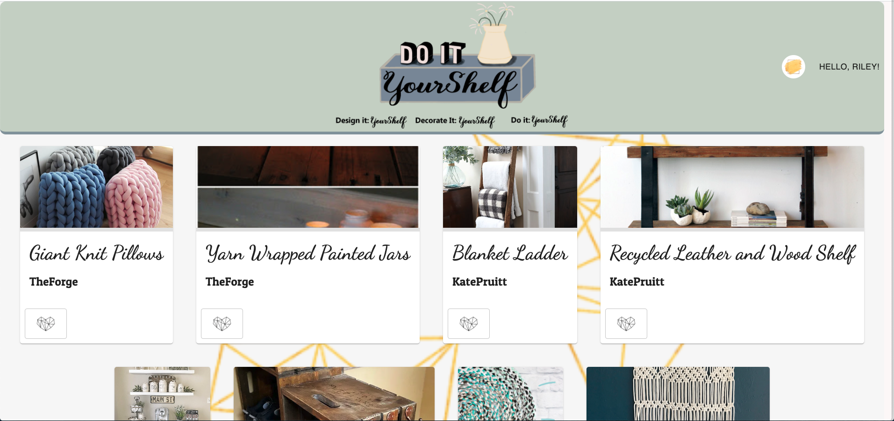

# YourShelf

## Description

This application was created as a place for DIYers to share and see projects others have made. Users can create an account and login, and see all projects that have been created in the app. Users can click on a project to see more details about it. If they like the project, they are able to favorite it, and save it in their "shelf" to view later. Users can also create their own projects, and edit/delete those as well. This application is a full-stack full CRUD development.

# Prerequisites

This application uses React, Redux, Express, Passport, and PostgreSQL (a full list of dependencies can be found in `package.json`).

This application also uses AWS to handle the image upload.

 
## Directory Structure:

- `src/` contains the React application
- `public/` contains static assets for the client-side
- `build/` after you build the project, contains the transpiled code from `src/` and `public/` that will be viewed on the production site
- `server/` contains the Express App

## Installation

1. Create a database named "yourshelf"
2. Use the database.sql file to find a base level of all neccessary tables, along with some provided data. This application is built on Postgres, and all creation of the tables and data was done through Postico. Any other database applications were not tested.
3. Open in editor and run "npm install" in your terminal
4. Run "npm run server" in your terminal to start your server
5. Add a second terminal tab and run "npm run client" to start up the application

## Usage
- If the user is already exisiting, log in using the log in form.
- If the user is new, create a new user by clicking on "new user? Register here!" and completing the Registration Form.
- Browse all created projects on the home page.
- Click on a project to see more information about it.
- Click on the heart to "favorite" a project.
- View favorited projects in the "View Your Shelves" tab in the drop down menu.
- Click "delete" if the user want to delete a favorite.
- View projects the user has created by clicking on "View Your Projects" tab in the drop down menu.
- Create a new project by clicking on "create new project".
- View all projects the user created.
- Click "edit" to edit a project the user has created.
- Click "delete" to delete a project the user has created.

## Built With

- React
- Redux
- Node.js
- Postgres
- Axios
- Material UI
- AWS cloud services

## Acknowledgement

Thanks to [Prime Digital Academy](www.primeacademy.io) who equipped and helped me to make this application a reality.

## Support
If you have suggestions or issues, please email me at riley_ww77@yahoo.com.

